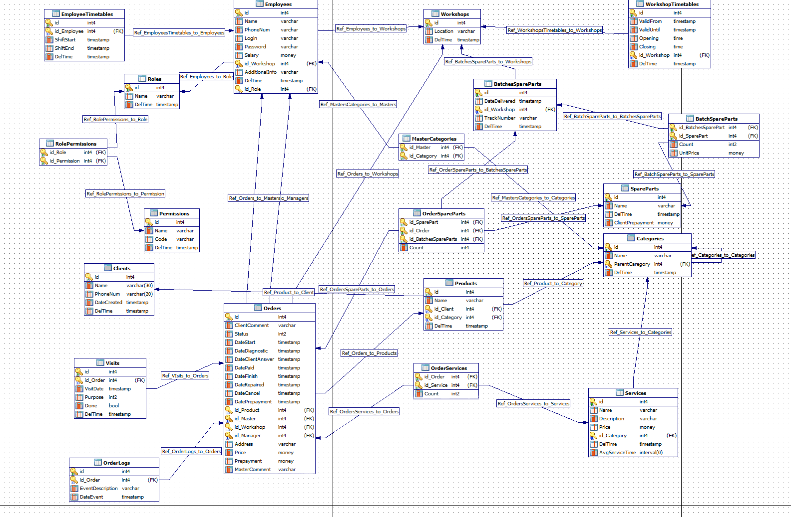

# Database-SQL-queries
В данном репозитории находится схема реляционной базы данных для сервисного центра по починке техники, а также различные запросы на выборку данных.

<br>

Целью данной работы является получения наваков построения реляционных баз данных и знакомство с SQL синтаксисом.

<hr>

## Схема базы данных


<hr>

## Запросы к базе данных
### Самая популярная услуга в сентябре:
```
SELECT Services.id, Services.Name, Services.id_Category, SUM(OrderServices.Count) AS sumResult
FROM Services
INNER JOIN OrderServices
ON OrderServices.id_Service = Services.id
INNER JOIN Orders
ON Orders.id = OrderServices.id_Order AND Orders.DateStart >= '2021/08/01 00:00:00' AND Orders.DateFinished < '2021/09/01 00:00:00'
GROUP BY Services.id, Services.Name,  Services.id_Category
ORDER BY sumResult DESC
LIMIT 1
```

<hr>

### Менеджер, у которого больше всего заказов в августе
```
SELECT res.id, res.Name, MAX(res.countResult) AS 'Count'
FROM
(
SELECT Employees.id, Employees.Name, Count(*) countResult from Employees
INNER JOIN Orders ON Orders.id_Manager = Employees.id AND Orders.DateStart >= '2021/09/01 00:00:00' AND Orders.DateFinished < '2021/10/01 00:00:00'
GROUP BY Employees.id, Employees.Name
) res
```

<hr>

### ТОП 10 самых дорогих заказов
```
SELECT Orders.id, Orders.DateStart, Orders.DateFinished, SUM(OrderServices.Count * Services.Price) AS sumResult
FROM Orders
INNER JOIN OrderServices
ON Orders.id = OrderServices.id_Order
INNER JOIN Services
ON Services.id = OrderServices.id_Service
GROUP BY Orders.id, Orders.DateStart, Orders.DateFinished
ORDER BY sumResult DESC
LIMIT 10
```

<hr>

### Неиспользуемые в сентябре услуги
```
SELECT Services.id, Services.Name, Services.id_Category
FROM Services
WHERE Services.DelTime IS NULL
EXCEPT SELECT Services.id, Services.Name, Services.id_Category
FROM Services
INNER JOIN OrderServices
ON OrderServices.id_Service = Services.id
INNER JOIN Orders
ON Orders.id = OrderServices.id_Order AND Orders.DateStart >= '2021/09/01 00:00:00' AND Orders.DateFinished < '2021/10/01 00:00:00'
```
Пояснения к запросу. В данном запросе используется ```WHERE Services.DelTime IS NULL```, чтоб отбросить удаленные услуги

<hr>

### Количество обслуженных заказов сотрудниками (и менеджеры, и мастера)
```
SELECT Employees.id, Employees.Name, count(*)
FROM Employees
INNER JOIN Orders
ON (Orders.id_Manager = Employees.id OR Orders.id_Master = Employees.id) AND Orders.DateStart >= '2021/09/01 00:00:00' AND Orders.DateFinished < '2021/10/01 00:00:00'
GROUP BY Employees.id, Employees.Name
```
Пояснения к запросу. Т.к. нам нужны одновременно и менеджеры, и мастера, используется ```Orders.id_Manager = Employees.id OR Orders.id_Master = Employees.id```

<hr>

### Заказы, которые НЕ выполнял указанный мастер
```
SELECT Orders.id, Orders.DateStart
FROM Orders
WHERE Orders.id_Master != @masterID AND Orders.id_Master IS NOT NULL
```
Пояснения к запросу. В данном запросе используется ```Orders.id_Master IS NOT NULL```, чтоб отбросить заказы, в которых вообще не указан мастер

<hr>

### Заказ, где есть услуга с указанным названием (для удобства используется вхождение строки, а не полное соответствие )
```
SELECT Orders.id, Orders.ClientComment, Services.Name
FROM Orders
INNER JOIN OrderServices
ON OrderServices.id_Order = Orders.id
INNER JOIN Services
ON Services.id = OrderServices.id_Service AND Services.Name LIKE '%' || @servName || '%'
```
Пояснения к запросу. Запросы писались в SQLite, так что знак `||` отвечает за конкатенацию строк

<hr>

### Заказы, где номера телефонов клиентов начинаются на +7999
```
SELECT Orders.id, Orders.DateStart, Clients.Name, Clients.PhoneNum
FROM Orders
INNER JOIN Products
ON Products.id = Orders.id_Product
INNER JOIN Clients
ON Clients.id = Products.id_Client AND Clients.PhoneNum LIKE '+7999%'
```

<hr>

### Заказы, где НЕТ услуг с указанным id
```
SELECT Orders.id, Orders.ClientComment, Orders.DateStart
FROM Orders
EXCEPT SELECT Orders.id, Orders.ClientComment, Orders.DateStart
FROM Orders
INNER JOIN OrderServices
ON OrderServices.id_Order = Orders.id
INNER JOIN Services
ON Services.id = OrderServices.id_Service AND Services.id = @servID
```

<hr>

## Файл на базу данных, к которой строились запросы
Файл находится в папке [database](./database "database")
<br>
**ПРИМЕЧАНИЕ! Данная база данных является облегченной версией [схемы](#схема-базы-данных), выложенной выше. Это было сделано, из-за ненадобностью некоторых таблиц и строк в данных запросах**
